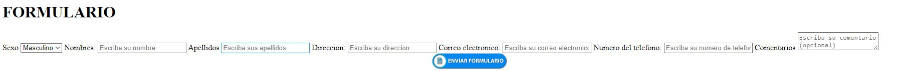
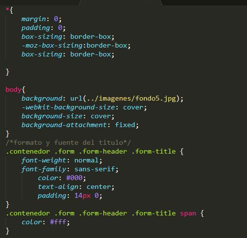
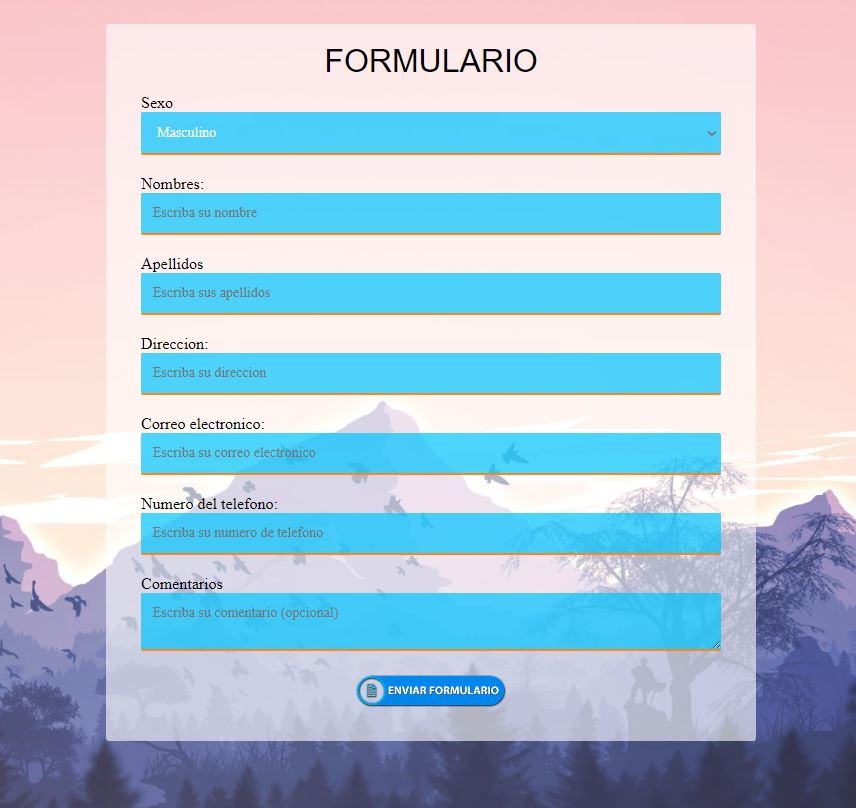

# **Formulario con HTML Y CSS**

Al igual que en la práctica pasada no es necesario tener altos conocimientos en el tema, solo hay que saber algunas sintaxis y la funcion que realiza cada una de ellas.


Comenzamos creando un archivo nuevo en sublime text y lo guardaremos con la extención *.html* y comenzamos a editarlo.
```
<!DOCTYPE html>
<html lang="es">
<head>
	<meta charset="UTF-8">
	<meta name="viewport" content="width=device-width, initial-scale=1.0">
```
Aquí definimos el nombre  que tendrá nuestra página web.
```
<title>Formulario</title>
<meta name="viewport" content="width=device-width, user-scalable=no, initial-scale=1.0, maximum-scale=1.0, minimum-scale=1.0">
</head>
```
 


Apartir de aqui ya tenemos que comenzar con el formato  que le daremos a nuestra página por lo cual primero hacermo y declaramos las clases que usaremos para su desarrollo.
```

<link rel="stylesheet" type="text/css" href="css/estilos.css">
<body>
	<div class="contenedor">
		<form action="" class="form">
			<div class="form-header">
			<h1 class="form-title">FORMULARIO</h1>
			<!--<h1 class="form-title">C<span>ontacto</span></h1> -->
			</div>	
```
Y continuamos agregando todos los demas campos y espacion que vamos a ocupar.
```
			
			<label for="Sexo" class="form-label">Sexo</label>
			<select type="text" name="sexo" id="sexo" class="form-imput"> 
			<option>Masculino</option>
			<option>Femenino</option>
			</select>

			<label for="Nombres"class="form-label">Nombres:</label>
			<input type="text" id="Nombres" class="form-imput" placeholder="Escriba su nombre">


```
Hasta aquí este sería nuestro resultado sin usar CSS.



CSS

A continuación debemos crear el archivo con extención *.css* en lo cual definiremos los estilos y daremos formato a toda nuestra estructura previamente creada, aqui heredaremos a las clases respectivas creadas en html.

Con esto damos formato a la ventana en general así como tambien empezamos a trabajar con las herencias entre nuestro archivo HTML y CSS.


Una ves terminado de dar formato a cada parte de nuestro formularioasi como a las diferentes clases.
Así es como se verá gracias a el CSS, con estilos y dandole formato a nuestra página.

Resultado Final


